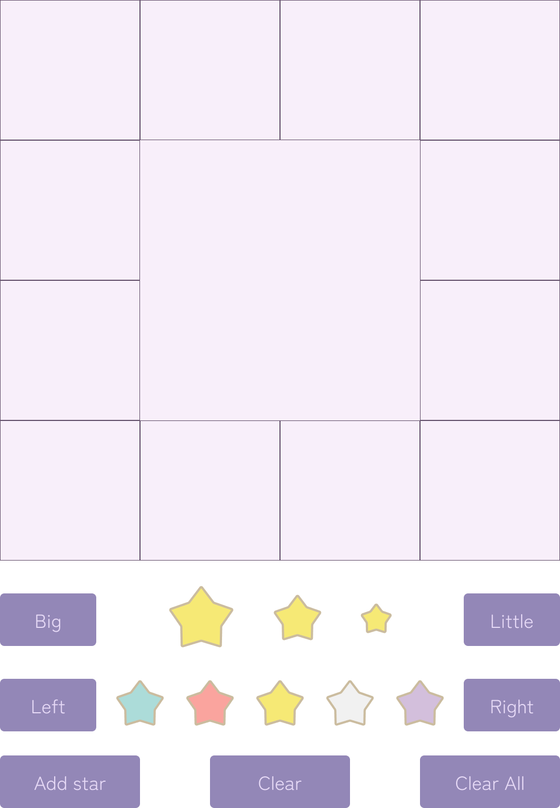
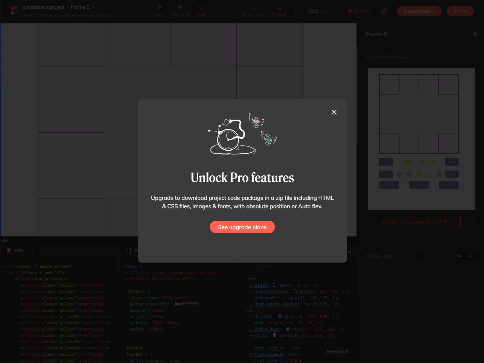

- [Figma 奮闘記](#figma-奮闘記)
  - [Figma との出会い](#figma-との出会い)
  - [Figma で占いページを書いてみる](#figma-で占いページを書いてみる)
  - [Figma プラグインとの格闘](#figma-プラグインとの格闘)
- [Figma から得た経験](#figma-から得た経験)
- [JavaScript への忌避](#javascript-への忌避)
- [JavaScript とアニメーション](#javascript-とアニメーション)
- [参考文献](#参考文献)

# Figma 奮闘記

## Figma との出会い

フロントエンドもバックエンドもやってるシステムエンジニア (SE) というのが
どれくらい珍しいものなのか分からない。
ともあれ、どちらもやってるらしい SE の知り合いができて、話を聞けた。

そもそもフロントエンドとバックエンドとは何なのか、という話だが、
私の認識では、

* フロントエンド: Web デザインとか GUI とか見た目のコードを書くところ。
* バックエンド: 裏方の業務用コードを書くところ。

くらいのイメージしかない。
以下の話もそれくらいのふわっとした印象で書いているので注意してほしい。

閑話休題。

その人によると、**フロントエンドは [Figma](https://www.figma.com/ja/) が流行り**らしい。
Figma はアニメーションも定義できる Web デザインツールで、
編集中でもみんなで同じファイルを共有・確認しながら作業できるので有名らしい。

しかも、 **Figma はプラグインが充実**していて、
**CSS (カスタムスタイルシート) を吐き出させることもできる**らしい。
つまり、 Figma でアニメーション付きの見た目を作って、
それを**ローカルに持ってきて HTML ファイルと連携させることもできそう**だと思った。

個人的にはアニメーションできる GUI が欲しかったので、
「それが簡単に定義できるなら」と思って Figma を触ってみることに。

実に、それが**フロントエンド沼の始まり**だったとは知らずに。

## Figma で占いページを書いてみる

とりあえず、**占い用のページと、操作用のボタンを書いてみた**。

おおよそ普通の占いサイトで見られるデザインでは無いかもしれないから、
簡単に説明しておこう。

まず、正方形の周上に、12個の小さい正方形が並んでいる。
これは**紫微斗数**という占いにおける**命盤**と呼ばれるものだ。
全体が仮想的な星図を表していて、どの星がどこに入るかによって運勢を占う。
とはいえ、どこがどんな役割をしているのか、
何の星がどこに入るのかというのは、
誕生日と誕生時間による少々複雑な計算と配置規則が必要となる。
そこまで最初からやるのは面倒すぎるので、
とりあえずそれらが入る場所だけ用意した。

とはいえ、**星図に何も星が入っていないというのはいただけない**。
そこで、**星を入れるためのインターフェース**として、
命盤の下の方に**ボタンを用意した**。
星の重要度に合わせて大きさを変えたり、
星のタイプ(正確には陰陽五行理論における五行)に応じて色を変えたりしたかったので、
それらを変えられるようにしている。
そして、「Add star」ボタンで星を追加したり、
「Clear」 や 「Clear All」ボタンで初期化したりして、
とりあえず**遊べる何かを作りたかった**。
というか、遊べる何かのベースとなるデザインを作った**つもりだった**。

## Figma プラグインとの格闘

ここからは **Figma プラグインとの格闘**だった。

デザインの次の工程は、 Figma のデータを CSS に出力することだ。
Figma は作業ファイルの情報を
**Figma 用の .fig 拡張子のファイル**に保存している。
当然**バイナリ形式**なので、テキストエディタで読み取ってみたりということも叶わない。
エクスポート機能もあるのだが、何故か**画像ファイルとしてしか出力できない**ので、
当然ながらインタラクティブなアニメーション要素はすべて失われる。

最初に知り合いから話を聞いて、
プラグインで CSS エクスポートが可能という情報は聞いていたのだが、
特に何のプラグインがおすすめとかは聞かなかった。
**「CSS 出力程度で困ることは無いだろう」という楽観**もあった。

実際、 Figma のプラグイン利用は非常に簡単で、
VScode が標準でアイコンから拡張機能にアクセスできるのと同じように、
Figma も標準でアイコンから探すだけで Web 上の拡張機能と連携できるようになっている。
そこから CSS エクスポート機能を謳っているサービスを試してみることにした。

最初に試したのは [anima](https://www.animaapp.com/figma) プラグインだった。
コンポーネントを選択して、エクスポートすると、
anima のサイトに飛ばされて、そこのプロジェクトに変換される。
そして、そのページにも "Export code" のボタンがあり、
意気揚々とそれをクリックした。

そう。 HTML エクスポートは**有料機能だった**。
"Time is money." というか "Code is money." というかと
言わんばかりの図と共に、 **pro 版への移行を誘導された**。

それでも、今覚えば一番よくできていたプラグインかもしれない。

さすがに CSS エクスポートくらいで金を取る、
なんて尋常ではないと（当時は）思っていたので、他のプラグインを探すことにした。

以下は、試してみたプラグインと、ダメな理由を挙げ連ねたものだ。

* Overlay: これもログイン制で別サイト経由でプロジェクトを作ってからエクスポートするもの。 CSS 変数が8個までしか使えない上に、アニメーション要素がエクスポートできない。
* Figma to Code: 命盤の形が特殊な都合上、表示が崩れやすいらしく、これは対応できなかった。
* Figma to HTML/React by psCode: よくわからないサイトに飛ばされて、機能を使うには全部のチュートリアルを終えろと言われたので即ブラウザバック。
* Figma to HTML and CSS: プレビューの表示がやはり崩れてしまっておりアウト。
* Export Figma to Websites and HTML by Siter.io: これも登録必須だった上に、怪しい中国語の翻訳みたいな日本語を出されて即解約。

……という感じで、まともに使えそうなものが無かった。
特に Siter.io に触れて、
フロントエンド環境が**如何に拝金主義の沼**で成り立っているのかを知った気がした。
どれもアニメーションのエクスポートも満足にサポートできていないのに、
登録必須で自社サービスに引き込もうとする挙げ句、
Pro 版移行で金を毟り取ろうという魂胆。
ましてや、それっぽいサイトさえ作っておけば、
金を払ってくれるバカなユーザーが登録してくれるだろうと思っていそうな、
出来の悪いサイトまで存在する。
フロントエンドの沼、というか、**闇の深さ**を思い知った。

# Figma から得た経験

そもそも、 HTML は学校時代に少し静的な Web ページを作ってみたことがあるだけで、
最近の Web ページ事情など知ったこっちゃなかった。
だが、エクスポート機能をいくつも試してみるうちに、以下のような法則に気づいた。

* HTML 要素は全部 div タグで階層構造を組み、 class だけ割り当てる。
* CSS で class ごとに描画用の設定を割り当てて、見た目を表現する。

これは、ある意味 GUI プログラミングと同じだ。
GUI プログラミングでも、 GUI 要素をオブジェクトの階層構造で表して、
それぞれのプロパティ値を設定することで見た目を表現する。
ただ、普通の GUI はアニメーションはあまりサポートしていないので、
簡単なアニメーションでもキャンバスを直接弄って絵を描くコードを書かないといけない。
そうなるとコード量が多くなるし、そもそも面倒すぎる。

そういう意味では、アニメーション用ライブラリが豊富で、
しかも手軽に使えそうな JavaScript は良さそうな選択肢である。

# JavaScript への忌避

だが、個人的には JavaScript には忌避感があった。

というのも、普段目にする JavaScript のコードというのが、
HTML で自動生成されたであろう見るに堪えないコードばかりだからだ。
Python をよく使うので、
改行すらまともにされていない構造のコードを見ると頭が痛くなる。

JavaScript には型も無い。
Python にも無いのだが、 Typing という仕組みである程度カバーされている。
JavaScript のスーパーセットで TypeScript というのは型があるらしいが、
よく知らない。

というか、 JavaScript には
そういうスーパーセットとかサブセットがいくつかあるらしい。
TypeScript もそうだし、
CoffeeScript というのも VSCode で触ったことがあるし、
何なら Dart とかいうのもあるらしい。

その上、 Node.js とかいう謎のソフトウェアが幅を効かせている。
どうもデーモンか何かの常駐プログラムらしく、
Web サーバーのようにそれを動かし続けないと JavaScript のプログラムは動かないらしい
（※実際は違った）。

という感じで、

* そもそも自動生成されるコードなので人が触るものじゃない。
* 型が無い上に整形文化も無いので無茶苦茶なコードになる。
* スーパーセットがいくつもある＝絶賛迷走中のプログラミング言語。
* なんか常駐プログラムを動かさないとダメらしい？

という（ド偏見な）印象しか持ってなかった。

# JavaScript とアニメーション

だが、どうも調べたところ、
**Javascript は、 WEB 用のアニメーションの定義と不可分である**と分かった。
HTML 要素にマウスオーバーしたときに色を変える、くらいだったら CSS で十分だが、
何かの要素を操作したときに別の要素を書き換えたり、
そもそも新たな要素を追加したりといったことは、 CSS の範疇外のようだった。

HTML でアニメーションを触るなら、 JavaScript は不可避。
別の方法もあるんだろうと勝手に思っていたので、少し衝撃だった。

とはいえ、不可避というなら、逆に一度触ってみようと思った。
調べてみると、いくつかのアニメーション用ライブラリが存在し、
また、以下のようなステップでアニメーションができると分かった。

* iD 指定でアニメーション対象を指定する。
* 指定したアニメーション対象のイベントタイミングとイベントリスナーを設定する。
* イベントリスナーは CSS のプロパティ値の変更で対応する。

言い換えれば、実現したいイベントを、 CSS のプロパティで実現できればいい。
後はプロパティを変更するよう指定してやれば、アニメーションができる。

そして、 JavaScript 導入に当たって Node.js の導入もしてみたところ、
これは単なる実行環境、つまり、 python でいうところの pip みたいなものであって、
別に常駐プログラムとかではないらしいと分かった。

こういった経緯で、本稿では、
JavaScript/TypeScript について調べたり実践したりして、
占いページ用のアニメーション付き HTML を作っていった。
そのあらましを備忘録として記述していく。

# 参考文献

* ["Figma"](https://www.figma.com/ja/)
* 動画でtorikumu, ["2時間で理解する！Webデザイナー向けfigma初心者講座"](https://www.youtube.com/watch?v=02jXCtgB7OQ) -- YouTube, 2023/02
* ["anima"](https://www.animaapp.com/figma)
