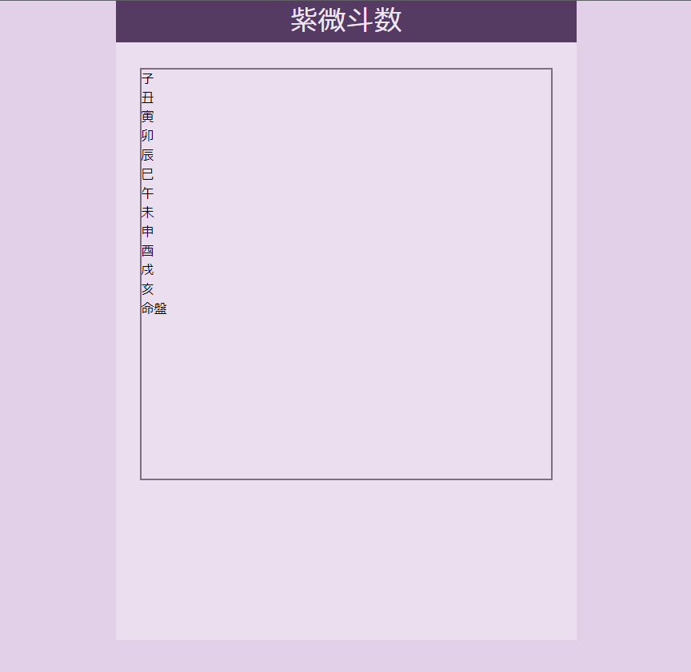
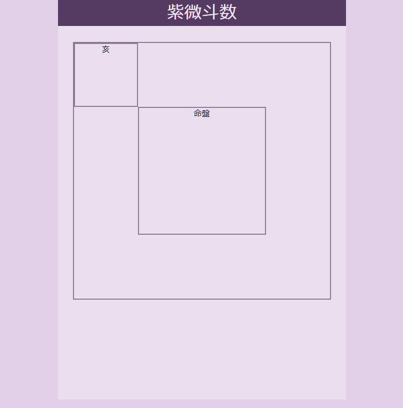
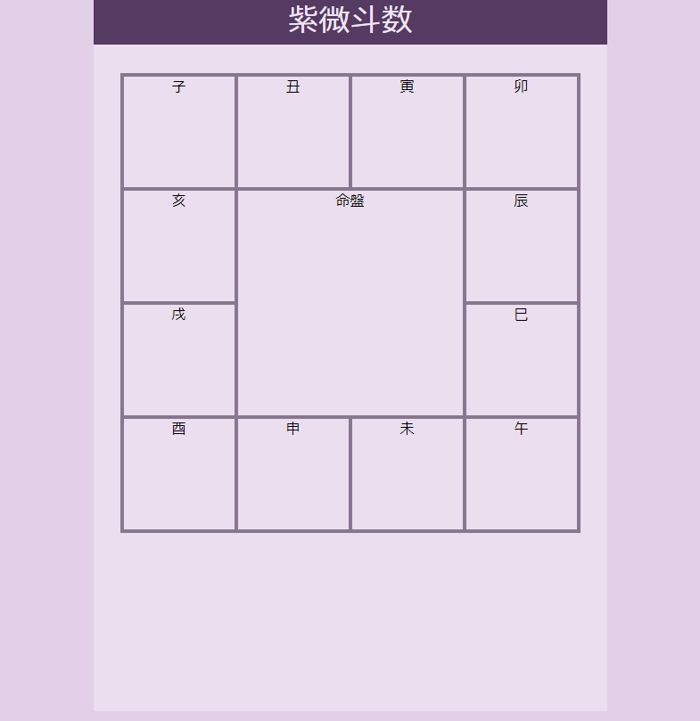
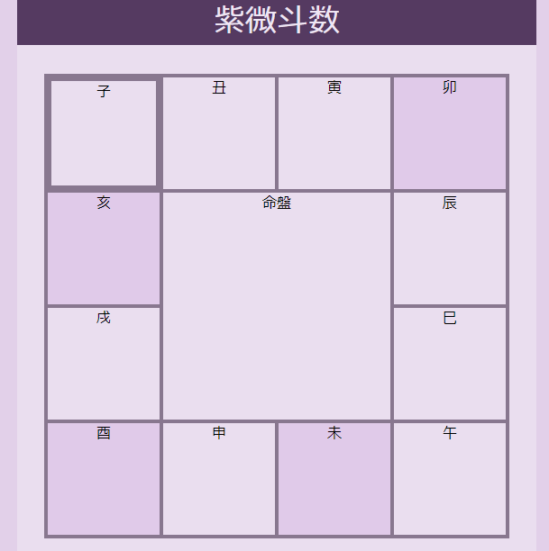

# 概要

ここでは、紫微斗数という占いの命盤を作るための盤面を表す HTML/CSS と、
そこにアニメーションを加える TypeScript を書いてみる。

- [概要](#概要)
- [盤面の作成](#盤面の作成)
  - [HTML](#html)
  - [CSS (ベースの配置)](#css-ベースの配置)
  - [CSS (宮の設定)](#css-宮の設定)
  - [CSS (宮の配置)](#css-宮の配置)
- [TypeScript によるアニメーションの追加](#typescript-によるアニメーションの追加)
  - [宮の選択](#宮の選択)
  - [宮のハイライト](#宮のハイライト)
- [まとめ](#まとめ)

# 盤面の作成

0章で図示したように、紫微斗数は命盤と呼ばれる盤面に星を配置して占う、いわゆる占星術である。
正方形の周上に、12個の小さい正方形を配置して、そこに星を配する。
この12個の箱を「宮」と呼び、12個の宮が集まった盤面のことを命盤と呼ぶ。
先ずは、 HTML/CSS でこの盤面を定義していこう。

## HTML

盤面は時計回りに定義されており、
HTML で一般的に定義されるような階層構造ではない。また、表とも少し違う。
そのため、 `<div>` 要素を綺麗に12個並べる必要がある。

とりあえず、 HTML ファイルに div 要素を 12個並べてみよう。

```html
<!DOCTYPE html>
<html lang="ja">

<head>
    <meta charset="utf-8">
    <title>練習</title>
    <meta name="description" content="HTML 練習">
    <meta name="keywords" content="HTML">
    <link rel="stylesheet" href="style.css">
</head>

<body>
    <div class="background-frame">
        <div class="foreground-frame">
            紫微斗数
        </div>
        <div id="life-board" class="life-board">
            <div id="palace-0" class="palace-box palace">子</div>
            <div id="palace-1" class="palace-box palace">丑</div>
            <div id="palace-2" class="palace-box palace">寅</div>
            <div id="palace-3" class="palace-box palace">卯</div>
            <div id="palace-4" class="palace-box palace">辰</div>
            <div id="palace-5" class="palace-box palace">巳</div>
            <div id="palace-6" class="palace-box palace">午</div>
            <div id="palace-7" class="palace-box palace">未</div>
            <div id="palace-8" class="palace-box palace">申</div>
            <div id="palace-9" class="palace-box palace">酉</div>
            <div id="palace-10" class="palace-box palace">戌</div>
            <div id="palace-11" class="palace-box palace">亥</div>
            <div id="palace-center" class="palace-box palace-center">命盤</div>
        </div>
    </div>
    <script src="dist/script.js"></script>
</body>

</html>
```

というわけで、12個の宮(palace)と、中央の大きな正方形 palace-center を定義した。
これら13個の div をそのままページ全体に載せるのではなく、
背景フレームとして background-frame、
前景フレームとして life-board を用意することにしよう。

div には id と class を既に割り振っておいた。
id はあとで TypeScript から参照するための名前だ。
class は CSS でスタイルを定義するためのものである。

## CSS (ベースの配置)

TypeScript は最後に触るとして、先ずは CSS を触っていこう。

CSS でも変数を定義できるので、
後でわかりやすくなるように、予めいくつかの変数を定義しておこう。

```css
:root {
    --white: rgb(239, 230, 244);
    --dark: rgb(85, 58, 97);;
    --background-bg: rgb(226, 208, 233);
    --foreground-fg: var(--white);
    --foreground-bg: rgb(85, 58, 97);
    --palace-fg: var(--dark);
    --palace-bg: rgb(234, 222, 239);
    --palace-bd-width: 2px
}
```

VScode の拡張機能でカラーピッカーを入れていると、色選択がやりやすい。

次に、 body, background-frame, foreground-frame, life-board を定義していく。

```css
body {
    background-color: var(--body-bg);
    height: 100vh;
    margin: 0;
}

.background-frame {
    background-color: var(--background-bg);
    height: 95vmin;
    width: 62vmin;
    min-width: calc(512px + 32px * 2);
    min-height: calc(512px + (64px + 32px) * 3);
    margin: 0 auto;
}

.foreground-frame {
    background-color: var(--foreground-bg);
    color: var(--foreground-fg);
    font-family: "Zen Maru Gothic";
    font-size: 35px;
    width: 100%;
    text-align: center;
}

.life-board {
    background-color: var(--palace-bg);
    width: 60vmin;
    height: 60vmin;
    min-width: 512px;
    min-height: 512px;
    max-width: 1024px;
    max-height: 1024px;
    border: 2px solid var(--palace-bd-color);
    position: relative;
    margin: 32px auto;
}
```

イメージとしては、

* body: 全体の背景
* background-frame: 命盤を載せるフレーム。後で操作用のボタン等を載せるために少し縦長にしている。
* foreground-frame: 「紫微斗数」という名前を書いたヘッダ部分。
* life-board: 12宮を載せていくための正方形のフレーム。

というような具合だ。

現時点では、以下のような表示になるはずである。



## CSS (宮の設定)

これから、 CSS の機能を活用して　12宮を配置していこう。

どういう戦略で12宮を配置するかというと、
% 指定で25%ずつの大きさで宮の大きさと位置を指定する、
という単純な方法を採ることにしよう(というより他に思いつかなかった)。

こういう場合、基本的には親要素に `position: relative` を入れておき、
子要素に `position: absolute` を入れればいいらしい。

先んじて life-board に `position: relative` は入れておいたので、
palace-box を以下のように設定することにしよう。

```css
.palace-box {
    position: absolute;
    background-color: var(--palace-bg);
    border: var(--palace-bd-width) solid var(--palace-bd-color);
    box-sizing: border-box;
    text-align: center;
}
```

背景色、境界線を設定するとともに、 `box-sizing` を指定している。
これを `border-box` に指定することで、
境界（border）および内部余白（padding）が、
要素に指定した幅（width）および高さ（height）の中に含まれるようになる。
今回は境界線含め綺麗に 25% のサイズになってほしいので、
`border-box` を指定している。

次に、 palace と palace-center を設定してみよう。

```css
.palace {
    width: 25%;
    height: 25%;
    min-width: 128px;
    min-height: 128px;
}

.palace-center {
    width: 50%;
    height: 50%;
    min-width: 256px;
    min-height: 256px;
    top: 25%;
    left: 25%;
}
```

大きさと最小サイズを設定する。
palace-center に関しては、位置も設定しておいた。
`top` と `left` がそれだ。

今のところ、 index.html の見た目は以下のようになっているはずだ。



## CSS (宮の配置)

図では、12宮が一箇所に重なってしまっている。
最後に、これを正方形の周上に並べていきたい。

しかし、 palace を表す div 要素には、別々の class 名を割り当てなかった。
どうやって 12宮の div を区別しながら位置を調整すればいいだろうか？

どうも、最近の CSS には `nth-of-type()` などという記法があるらしい。
これで、「N 番目の要素に対して CSS を指定する」ということができるようだ。

具体的には、以下のように書けばいい。

```css
.palace:nth-of-type(1) {
    top: 0%;
    left: 0%;
}

.palace:nth-of-type(2) {
    top: 0%;
    left: 25%;
}

.palace:nth-of-type(3) {
    top: 0%;
    left: 50%;
}

[...]

.palace:nth-of-type(12) {
    top: 25%;
    left: 0%;
}
```

途中省略しているが、 25% ずつパラメータを変えながら、正方形の周上に時計回りに配置している。

これで、以下の図のようにきれいに宮が並ぶはずだ。



最近の HTML/CSS の進化には驚くばかりである。
(いや、もしかしたら昔からできたのかもしれないが・・・。)

また、全体的に省略気味で恐縮である。
とはいえ、 HTML/CSS 関連は逐一説明しているといくらスペースがあっても足りない。


# TypeScript によるアニメーションの追加

ここでは、以下の2つのアニメーションを追加していきたい。

* **クリックで宮を選択する。** 選択した宮の境界線が太くなるようにする。
* **マウスオーバーで三方四正をハイライトする。** マウスオーバーした三方四正に当たる宮の色が濃くなるようにする。

「三方四正」については説明が必要だろう。
簡単に言うと、ある宮から見て、対角線上にある宮(対宮)と、その対宮の両側2つ隣の宮(三合宮)を意味する。
例えば、「子」宮から見ると、「午」宮が対宮で、「午」宮・「辰」宮・「申」宮が三方四正となる。
占いをする上で、各宮がそれぞれ人生運とか金運とか恋愛運とかを表す訳だが、
その宮だけでなく、その宮の三方四正とされる3つの宮も重要とされているので、
自動でハイライトしてくれると助かるのだ。

まず、下準備として、 宮を表す div 要素を取得していこう。
後で余り計算を用いて宮を選択しなければならないことは確実なので、
宮リスト palace_list を持っておく必要がある。
また、選択状態を保持しておく変数リストも必要だろう。

ということで、コードは以下のようになる。

```typescript
function main() {
    const palace_list: HTMLElement[] = []
    const palace_list_selected: boolean[] = []
    const n = 12
    for (let i = 0; i < n; i++) {
        const palace = document.getElementById(`palace-${i}`)
        if (palace == null) {
            throw new Error("palace not found.");
        }
        palace_list.push(palace)
        palace_list_selected.push(false)
    }
}
```

クラスを導入したい気持ちもあるが、それは後でテスト環境と MVVM パターンを導入してからにしよう。


## 宮の選択

まず、宮の選択アニメーションを導入しよう。

厳密には、これは「宮の選択」と「宮の選択解除」の2段階のアニメーションになる。

宮がクリックされたとき、(未選択状態ならば)選択状態にして、「宮の選択」アニメーションを実行する。

他の宮がクリックされたり、既に選択状態の宮が選択された場合は、
選択済みの宮について「宮の選択解除」のアニメーションを実行する必要がある。

とにもかくにも、先ずはアニメーションを実行する関数を定義しておこう。

```typescript
function AnimeChangeBorder(element: HTMLElement, width: string) {
    anime({
        targets: element,
        borderWidth: width,
        duration: 200,
        easing: 'linear'
    })
}
```

AnimeChangeColor 関数の backgroundColor を borderWidth に置き換えただけの簡単なものだ。

これを、クリック時に適切に実行されるようにすればいい。
具体的には、以下のコードで動作する。

```typescript
palace.addEventListener('click', () => {
    let next_state = !palace_list_selected[i]
    if (next_state) {
        AnimeChangeBorder(palace, "6px")
    }
    for (let j = 0; j < n; j++) {
        if (palace_list_selected[j]) {
            palace_list_selected[j] = false
            AnimeChangeBorder(palace_list[j], "2px")
        }
    }
    palace_list_selected[i] = next_state
});
```

アルゴリズムは、少しギミック的だが、以下のようになっている。

1. まず、次状態が `next_state` に入る。
2. 次状態 `next_state` が選択状態になる場合は、境界線を 2px から 6px に太くする。
3. 次に、他の宮の状態を確認する。既に選択状態のものがある場合は、それを非選択状態にする。境界線を 6px から 2px に細くする。
4. 最後に、クリックされた宮の状態を `next_state` に更新する。

これで、宮の選択・非選択状態を切り替えるアニメーションができた。

## 宮のハイライト

次に、宮のハイライトを行うアニメーションを導入しよう。

ハイライト、つまり、色変更自体は既に学んだ技術だ。
しかし、今回は一度に4つの宮の色を変更しなければならない。

とはいえ、余り演算を用いれば話は簡単で、コードは以下のようにすればいい。

```typescript
const originalColor = "rgb(234, 222, 239)";
const highlightColor = "rgb(224, 202, 233)";

[...]

    palace.addEventListener('mouseover', () => {
        AnimeChangeColor(palace, highlightColor)
        AnimeChangeColor(palace_list[(i + 4) % n], highlightColor)
        AnimeChangeColor(palace_list[(i + 6) % n], highlightColor)
        AnimeChangeColor(palace_list[(i + 8) % n], highlightColor)
    });
    palace.addEventListener('mouseout', () => {
        AnimeChangeColor(palace, originalColor)
        AnimeChangeColor(palace_list[(i + 4) % n], originalColor)
        AnimeChangeColor(palace_list[(i + 6) % n], originalColor)
        AnimeChangeColor(palace_list[(i + 8) % n], originalColor)
    });
```

マウスオーバーしたときに対象の宮をハイライトカラーに変更し、
マウスアウトしたときに対象の宮を元の色に戻す。
単純な話だ。
複雑なのは、三方四正を選択するために palace_list に対して余り演算を用いてアクセスしている部分くらいだろうか。

少し長いが、最終的な script.ts の内容は以下のようになる。

```typescript
import anime from "animejs"

function AnimeChangeBorder(element: HTMLElement, width: string) {
    anime({
        targets: element,
        borderWidth: width,
        duration: 200,
        easing: 'linear'
    })
}

function AnimeChangeColor(element: HTMLElement, color: string) {
    anime({
        targets: element,
        backgroundColor: color,
        duration: 200,
        easing: 'linear'
    })
}

function main() {
    const originalColor = "rgb(234, 222, 239)";
    const highlightColor = "rgb(224, 202, 233)";

    const palace_list: HTMLElement[] = []
    const palace_list_selected: boolean[] = []
    const n = 12
    for (let i = 0; i < n; i++) {
        const palace = document.getElementById(`palace-${i}`)
        if (palace == null) {
            throw new Error("palace not found.");
        }
        palace_list.push(palace)
        palace_list_selected.push(false)

        palace.addEventListener('click', () => {
            let next_state = !palace_list_selected[i]
            if (next_state) {
                AnimeChangeBorder(palace, "6px")
            }
            for (let j = 0; j < n; j++) {
                if (palace_list_selected[j]) {
                    palace_list_selected[j] = false
                    AnimeChangeBorder(palace_list[j], "2px")
                }
            }
            palace_list_selected[i] = next_state
        });
        
        palace.addEventListener('mouseover', () => {
            AnimeChangeColor(palace, highlightColor)
            AnimeChangeColor(palace_list[(i + 4) % n], highlightColor)
            AnimeChangeColor(palace_list[(i + 6) % n], highlightColor)
            AnimeChangeColor(palace_list[(i + 8) % n], highlightColor)
        });
        palace.addEventListener('mouseout', () => {
            AnimeChangeColor(palace, originalColor)
            AnimeChangeColor(palace_list[(i + 4) % n], originalColor)
            AnimeChangeColor(palace_list[(i + 6) % n], originalColor)
            AnimeChangeColor(palace_list[(i + 8) % n], originalColor)
        });
    }
}

main()
```

# まとめ

それでは、 `npm run dev` または `npm run build` を実行しよう。
最終的に、以下のようなアニメーションが動く WEB ページができあがったはずである
(図では、「子」宮がクリックされて選択され、「卯」宮がマウスオーバーされている状態)。



もし動かない場合は、 Google Chrome 等で TypeScript デバッグができるように、
以下の設定を webpack.config.js に入れるといい。

```javascript
module.exports = {
  // [他の設定...]

  devtool: 'source-map',
};
```

こうすると、 .map 形式ファイルが作成される。
これは、 webpack で生成された js ファイルと、
元々の script.ts ファイルとの間でのマッピングをしてくれるファイルで、
ブラウザデバッグする際に TypeScript コードでデバッグをしたいときに役に立つ。

さて、この命盤の宮に星を追加していきたい訳だが、
複雑なことを始める前に、次回は、今回行ったことを MVVM のパターンに落とし込んで、
モデルコードとビューコードが混在しないようにしていきたいと思う。
ついでにテストもできるようになるので、テスト環境も導入していこう。
